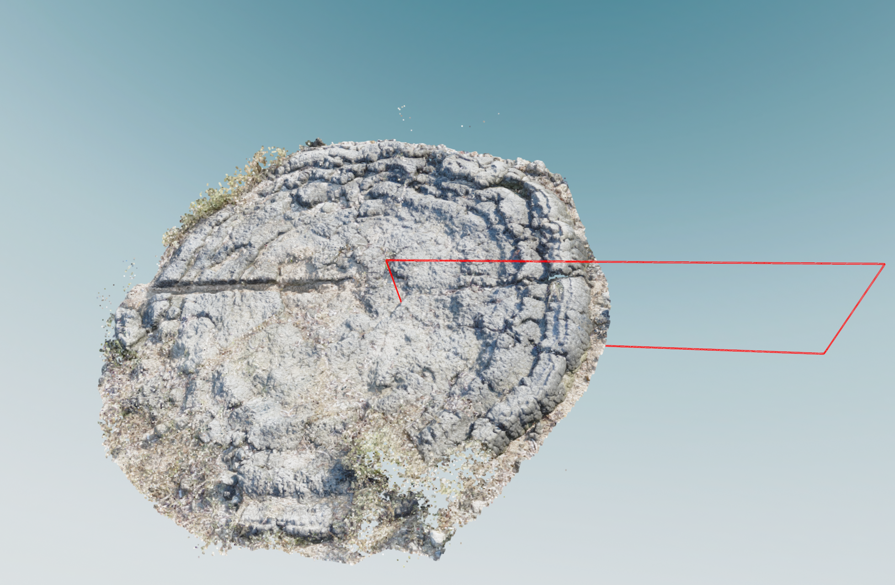

# Coral Slice Extraction

A Python tool for extracting and analyzing profiles from 3D point cloud data of coral microatolls.

<p align="center">
  
</p>

## Installation

1. Clone the repository:

```
git clone https://github.com/RohanGautam/coral_slice_extraction.git
cd coral_slice_extraction
```

2. Create a new conda environment:

```bash
conda create -n coral-profile python=3.8
conda activate coral-profile
```

3. Install required packages:

```bash
pip install open3d numpy matplotlib pandas jupyter openpyxl
```

## Project structure

```
├── data/ # Store your .ply files here
├── out/ # Output directory for CSV files
├── coral_slice.ipynb # Main notebook for processing
└── README.md
```

## Usage

1. Place your .ply files in the `data/` directory

2. Launch Jupyter Notebook

```bash
jupyter notebook # or open in vscode and select appropriate kernel
```

## Output

The script generates:

- CSV files containing profile data in the `out/` directory (a sample one is included)
- Scatter plot visualizations of the extracted profiles, in the notebook
